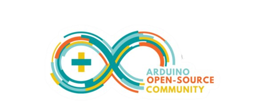
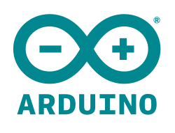
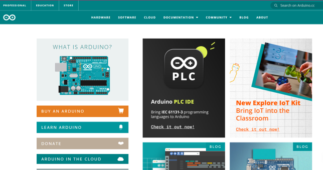

# ArduinoParaInexpertxs
Arduino para Inexpertxs considera los conocimientos básicos para empezar a trabajar con tu tarjeta eléctronica.

Creado por:
Compañeros, compañeras y compañeres del curso de Arduino a cargo de le Profesore Aaron Montoya [montoyamoraga](https://github.com/montoyamoraga)

Hola! Mi nombre es Victoria (Vick) y soy estudiante de Diseño. He creado está guía en parte para agradecerle a mi Maestre, Aaron Montoya y, por otro lado, para apoyar a aquellas personas que deseen empezar a utilizar esta maravillosa herramienta, con la cual se pueden crear infinidad de proyectos. Espero te sirva y disfrutes este viaje. Mucho éxito!

¿Qué es Arduino?

Arduino es una plataforma electrónica de código abierto basada en hardware y software fáciles de usar. Las placas Arduino pueden leer entradas (luz en un sensor, un dedo en un botón o un mensaje de Twitter) y convertirlo en una salida: activar un motor, encender un LED, publicar algo en línea. Puede decirle a su placa qué hacer enviando un conjunto de instrucciones al microcontrolador en la placa. Para ello se utiliza el lenguaje de programación Arduino (basado en Wiring), y el Software Arduino (IDE), basado en Processing.

¿Qué viene en mi kit y para qué es cada cosa?

Tu kit probablemente ses un poco complejo de entender al principio, primero veamos que contiene:
1x Arduino UNO Original
1x Protoboard 400pts
10x LED rojo
10x LED verde
1x LED Blanco
10x Condensador cerámico 10nf
11x Condensador cerámico 100nf
5x Condensador electrolítico 47uF
10x Resistencia 220 Ohm
10x Resistencia 1k Ohm
10x Resistencia 10k Ohm
1x Resistencia fotosensible
1x Servo
5x Botones pequeños
1x Potenciómetro de precisión
5x Switch
1x Buzzer
1x Cable USB de programación
65 x Cable Dupont para Protoboard

